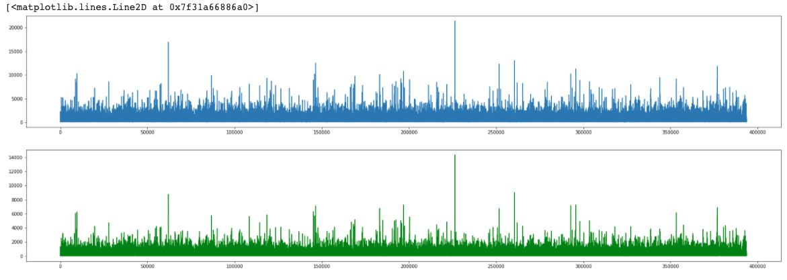
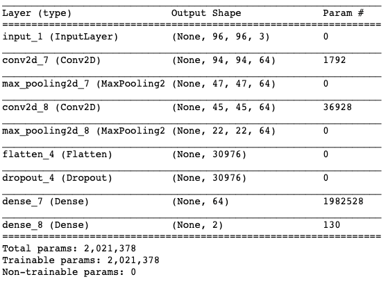
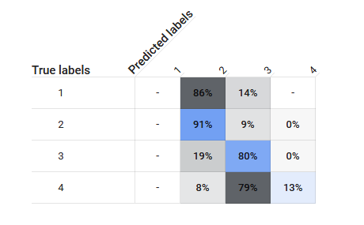
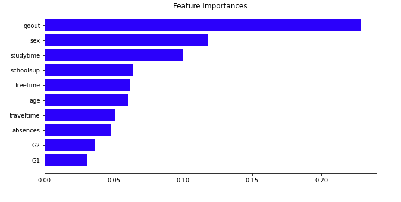

**Site Under Development**

## Data Science Portfolio

---
### Text Summarization of Amazon Food Reviews
[Natural Language Processing]
Built a text summarizer which generates shorter summaries of Amazon food reviews using a Multilayer LSTM Seq2Seq model with attention layer.
  

  

---
Face Mask Detection(Machine Learning)

---
### Prediction of Severity of Accidents in the US(Knowledge Based Systems)
Built a real-time prediction system to predict Traffic Accidents in the US, carried out exploratory data analysis and data preprocessing on Google Colab Notebook. Data ingestion was done using GCP's service BigQuery and a machine learning classfication model was trained using AutoMl tables.
  

  

---
Data Analysis of Student Alcohol Consumption(Software System Design and Implementation)

---
Walmart Sales Forecasting(Knowledge Discovery in Databases)

---

### Other Work

- [Project 1 Title](http://example.com/)
- [Project 2 Title](http://example.com/)
- [Project 3 Title](http://example.com/)
- [Project 4 Title](http://example.com/)
- [Project 5 Title](http://example.com/)

---
<!-- Remove above link if you don't want to attibute -->
