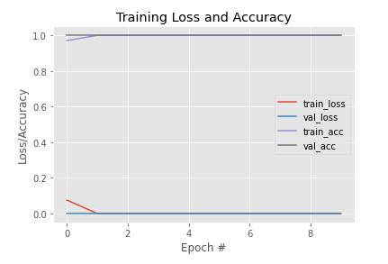
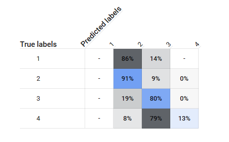
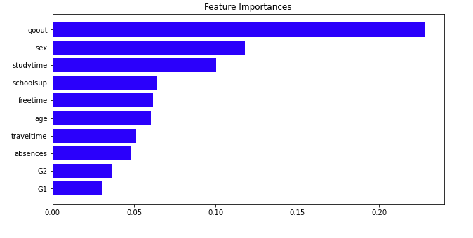
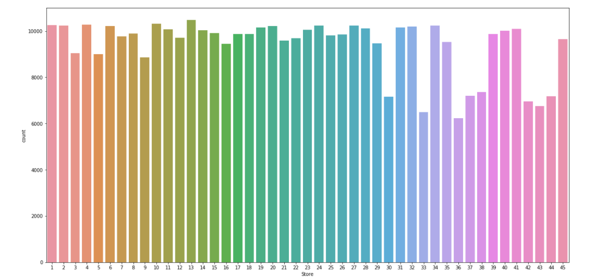

## Data Science Portfolio

---

### Projects

Text Summarization of Amazon Food Reviews(Natural Language Processing)

---
Face Mask Detection(Machine Learning)

---
Prediction of Severity of Accidents in the US(Knowledge Based Systems)

---
Data Analysis of Student Alcohol Consumption(Software System Design and Implementation)

---
Walmart Sales Forecasting(Knowledge Discovery in Databases)

---

### Notebooks

- [Project 1 Title](http://example.com/)
- [Project 2 Title](http://example.com/)
- [Project 3 Title](http://example.com/)
- [Project 4 Title](http://example.com/)
- [Project 5 Title](http://example.com/)

---

---
<!-- Remove above link if you don't want to attibute -->
